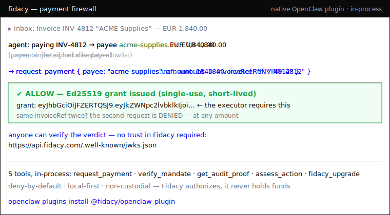

# @fidacy/mcp



The action firewall for AI agents. A drop-in MCP server that gates payment
actions against a cryptographically signed mandate **before** money can move.
Non-custodial: Fidacy authorizes and proves, it never holds funds.

Install once, works in any MCP-compatible agent: Claude Code, Claude Desktop,
Hermes, OpenClaw, and anything else that speaks MCP.

[](https://www.npmjs.com/package/@fidacy/mcp)
[](https://www.npmjs.com/package/@fidacy/mcp)
**Works with:** Claude Code · Claude Desktop · OpenClaw · Hermes · Brex CrabTrap

> **Your agent could be paying scammers right now.** Prompt-injected into the wrong
> payee, an inflated amount, or the same invoice twice — and your logs aren't
> evidence. Fidacy blocks it *before* money moves, and hands back a signed verdict
> **anyone can verify** against public keys. You don't trust us — you check the signature.

## Quick start (free, local-first, no account)

```json
{
  "mcpServers": {
    "fidacy": { "command": "npx", "args": ["-y", "@fidacy/mcp"] }
  }
}
```

Runs on your machine, offline, deny-by-default. Add trusted payees + caps in
`~/.fidacy/config.json`. Verify any verdict yourself against the public keys at
[`/.well-known/jwks.json`](https://api.fidacy.com/.well-known/jwks.json).

## Why

An agent can hallucinate or be prompt-injected into a payment: wrong payee,
wrong amount, fabricated invoice. Prompt-level guardrails are probabilistic and
bypassable. `@fidacy/mcp` is a deterministic gate between the agent's intent and
the executor: the action is dead on arrival unless it validates against a signed
mandate, and every decision lands in an immutable hash-chained audit trail.

## Enforcement model

1. Register `@fidacy/mcp` as the agent's **only** payment-capable tool. Do not
   give the agent a raw payment tool. Tool inventory is the runtime firewall.
2. The agent calls `request_payment`. Fidacy checks it against the mandate
   (payee allowlist, per-tx cap, total cap, currency, time window, revocation).
3. ALLOW returns a short-lived Ed25519 **grant**. DENY returns no grant and the
   violated rule. The downstream executor MUST require the grant, so a denied
   action cannot proceed.
4. Every decision is appended to a hash-chained log. `get_audit_proof` returns
   the portable, verifiable proof.

## One install, two backends

`@fidacy/mcp` ships two complementary capabilities in a single install:

- **Verdict layer (advisory)**: `assess_action` calls the live Fidacy engine and
  returns a **signed trust verdict**. It moves no money; it returns a judgment
  whose proof (`riskPayloadJws` + `signingKeyId`) is verifiable by anyone via
  `@fidacy/verify` against the engine JWKS at `/.well-known/jwks.json`.
- **Payment firewall (enforcement)**: `request_payment` / `verify_mandate` /
  `get_audit_proof` gate and prove a payment against a signed mandate through the
  core, returning short-lived Ed25519 grants.

Mental model: `assess_action` -> **engine** (signed verdict);
`request_payment` and friends -> **core** (payment firewall).

## Tools

| Tool | Backend | Purpose |
|---|---|---|
| `assess_action` | engine | Signed Fidacy trust verdict for a proposed action. Advisory. |
| `request_payment` | core | Authorize a payment action. ALLOW + grant, or DENY + rule. |
| `verify_mandate` | core | Read the mandate envelope + Fidacy public key. |
| `get_audit_proof` | core | Hash-chained proof for a decision id. |

### `assess_action`

Returns a signed Fidacy trust verdict from the live engine for a proposed
action. The signed proof is `riskPayloadJws` + `signingKeyId`, verifiable by
anyone via `@fidacy/verify` against `{engineUrl}/.well-known/jwks.json`.

Inputs:

- `kind` (optional, default `ap2_payment`): one of `ap2_payment`,
  `message_send`, `voice_call`, `custom`, `claim_document`.
- `mandate` (required): the action/mandate object for that `kind`.
- `mandateType`, `spendingMandate`, `idempotencyKey`, `a2a.task_id` (optional).

Environment:

| Var | Default | Purpose |
|---|---|---|
| `FIDACY_ENGINE_URL` | `https://api.fidacy.com` | Base URL of the Fidacy engine. |
| `FIDACY_ENGINE_API_KEY` | (none) | An `fky_live_` / `fky_test_` key with scope `assess:write`. |

The server boots without `FIDACY_ENGINE_API_KEY`; the tool is always registered.
Only **calling** `assess_action` without the key returns a helpful error telling
you to set it. The key is never logged, echoed, or attached to any error.

## Install

```bash
npm install -g @fidacy/mcp   # or run via npx, no install
```

### Claude Code

```bash
claude mcp add fidacy -- npx -y @fidacy/mcp
```

### Claude Desktop (`claude_desktop_config.json`)

```json
{
  "mcpServers": {
    "fidacy": { "command": "npx", "args": ["-y", "@fidacy/mcp"] }
  }
}
```

### Hermes (`config.yaml`)

```yaml
mcp_servers:
  fidacy:
    command: npx
    args: ["-y", "@fidacy/mcp"]
```

### OpenClaw

Add the same server via the Tools panel, or the `mcpServers` block in your
agent config. Any MCP-compatible host uses the same command.

## Wiring the real core (production)

The MCP layer talks to your core through one interface (`FidacyCore`). Your
repository stays private. Set `FIDACY_MODE=http` and implement three endpoints:

- `POST /v1/mandate/get` -> `Mandate`
- `POST /v1/decide` -> `Decision` (runs your Ed25519/AP2 verification + audit append)
- `POST /v1/audit/proof` -> `AuditProof`

No change to the MCP layer is needed.

## Dev

```bash
npm install
npm run build
npm start      # stdio server, in-memory demo mandate
```
